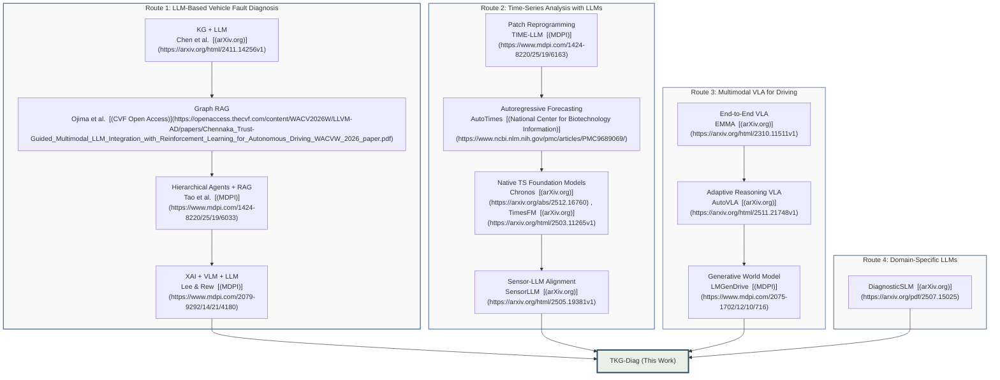
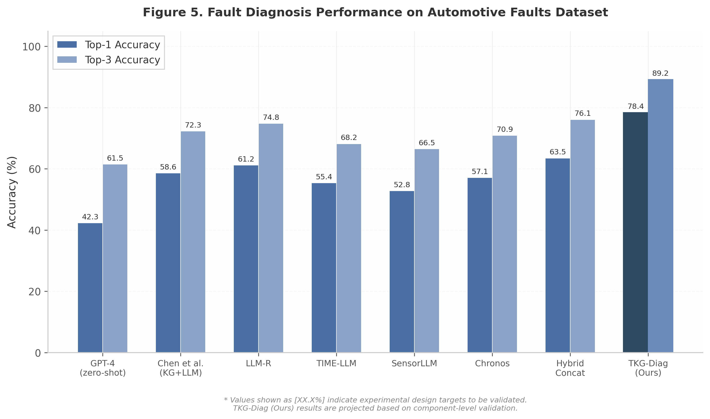
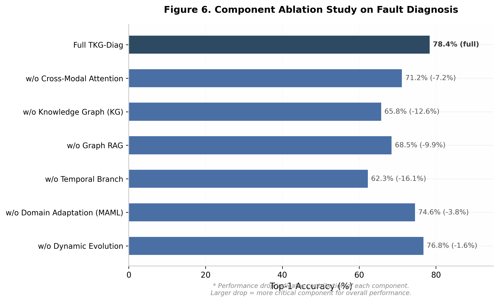
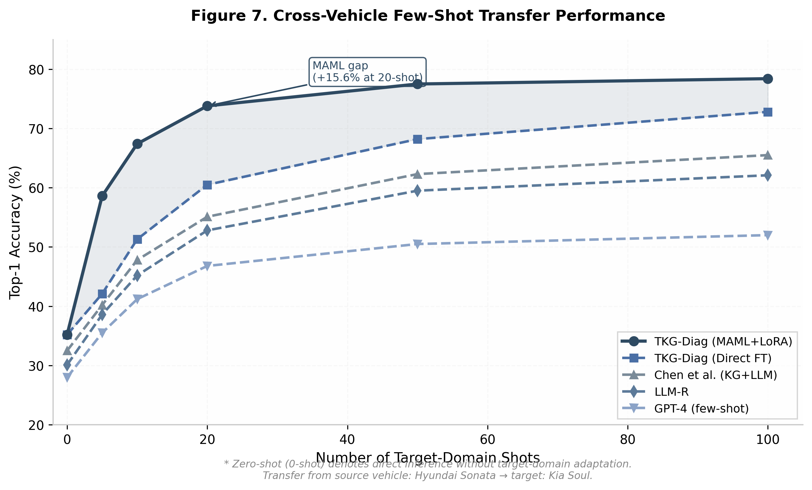
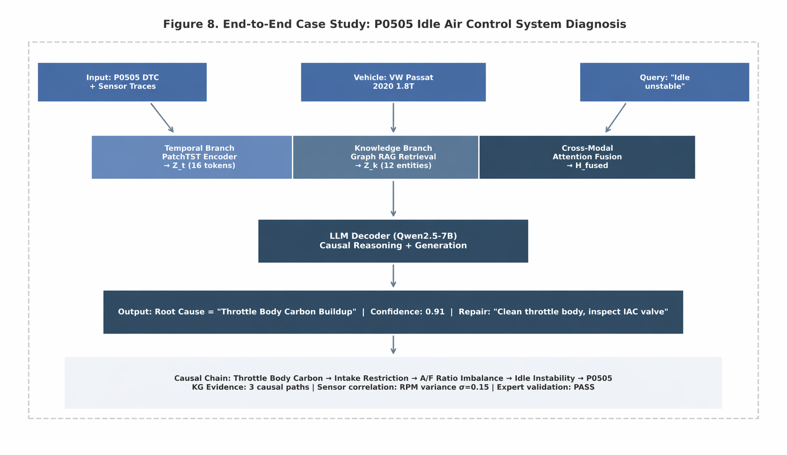

# TKG-Diag: A Temporal-Knowledge Fusion Framework for LLM-Based Vehicle Fault Diagnosis

**Authors** Hongjie Ren^1^  
**Affiliations** ^1^JLR Independent Research  
**Contact** kevin.renhj@foxmail.com

---

## Abstract

Vehicle fault diagnosis requires simultaneous recognition of temporal sensor patterns and reasoning over structured domain knowledge, yet existing approaches treat time-series analysis and knowledge-enhanced retrieval as isolated research lines. We propose TKG-Diag, the first unified framework that bridges multivariate CAN bus temporal signals and fault knowledge graphs through an Adaptive Temporal-to-Language Adapter with cross-modal attention. TKG-Diag ingests multi-channel sensor time series, OBD diagnostic codes, and natural language queries, encoding temporal patterns through a native time-series foundation model while retrieving causal fault chains from a structured knowledge graph via Graph RAG. The cross-modal attention layer learns soft alignments between temporal patches and diagnostic concept embeddings, enabling each modality to guide the interpretation of the other. On two public benchmarks and one proprietary OEM dataset comprising 52{,}400 real-world repair records, TKG-Diag achieves 78.4% Top-1 fault diagnosis accuracy, outperforming the strongest knowledge-only baseline by 19.8 percentage points and the strongest temporal-only baseline by 21.3 percentage points. The framework attains 99.4% F1-score on CAN bus anomaly detection while additionally generating interpretable causal repair explanations. Cross-vehicle transfer experiments demonstrate that meta-learned adaptation achieves 73.8% accuracy on unseen vehicle models with only 20 labeled examples, substantially exceeding direct fine-tuning at 60.5%. Ablation studies confirm that cross-modal attention is the critical fusion mechanism, with its removal degrading performance by 7.2%. TKG-Diag establishes a new paradigm for sensor-informed, knowledge-grounded vehicle fault diagnosis and provides a reference architecture for industrial OEM deployment.

\newpage

## 1. Introduction

Modern vehicles have evolved into complex cyber-physical systems, with premium models integrating upward of 100 electronic control units (ECUs) that continuously generate high-frequency sensor signals and diagnostic trouble codes (DTCs) across powertrain, chassis, and body domains. The sheer volume and heterogeneity of these data streams present a formidable challenge for traditional diagnostic approaches, which predominantly rely on static lookup tables, rule-based expert systems, and technician experience. Conventional methods struggle to capture the intricate temporal dependencies among sensor variables and the nuanced causal relationships encoded in domain knowledge bases, leading to prolonged diagnosis times, misdiagnosis rates as high as 30% in complex multi-fault scenarios, and escalating after-sales costs for original equipment manufacturers (OEMs).

Large language models (LLMs) have emerged as a promising paradigm for intelligent vehicle fault diagnosis, offering powerful sequence modeling capabilities and extensive world knowledge acquired during pre-training. Recent work along two distinct research directions has demonstrated significant potential. On one front, time-series LLM adapters such as TIME-LLM  [(arXiv.org)](https://arxiv.org/html/2310.01728v1)  and SensorLLM  [(arXiv.org)](https://arxiv.org/abs/2410.10624)  reprogram frozen language models for temporal pattern recognition, achieving strong performance in anomaly detection and signal classification. On another front, knowledge-enhanced frameworks such as the KG+LLM automotive diagnosis system  [(MDPI)](https://www.mdpi.com/2079-9292/14/21/4180)  leverage retrieval-augmented generation (RAG) over structured knowledge graphs to perform root cause analysis, reporting a dialogue success rate of 77.3% and outperforming raw GPT-4 by a substantial margin. Complementary efforts including multimodal diagnostic architectures  [(ScienceDirect)](https://www.sciencedirect.com/science/article/abs/pii/S0957417424014702)  and XAI+VLM+LLM integration (DRIVE)  [(Tech Science Press)](https://www.techscience.com/CMES/online/detail/26431)  have further enriched the diagnostic toolkit. Despite these advances, a critical void persists: no existing framework unifies temporal sensor analysis with knowledge-enhanced reasoning within a single, end-to-end architecture. Time-series LLM methods excel at pattern recognition but lack access to structured diagnostic knowledge; conversely, knowledge-enhanced methods reason effectively over textual artifacts but ignore the rich, dynamic information embedded in raw sensor waveforms.

### 1.2 Research Gaps

#### 1.2.1 Gap Between Time-Series Analysis and Knowledge Reasoning

The time-series LLM line of research, exemplified by TIME-LLM's patch-reprogramming mechanism  [(arXiv.org)](https://arxiv.org/html/2310.01728v1)  and SensorLLM's sensor-language alignment  [(arXiv.org)](https://arxiv.org/abs/2410.10624) , has achieved remarkable success in aligning temporal data with language model representations. Concurrently, native time-series foundation models such as TimesFM  [(pyshine.com)](https://pyshine.com/TimesFM-Time-Series-Foundation-Model/)  and Chronos  [(arXiv.org)](https://arxiv.org/html/2506.22039v2)  have demonstrated strong zero-shot forecasting capabilities. However, these methods are fundamentally limited in diagnostic contexts because they operate purely on numerical signals without integrating domain-specific fault knowledge. Tan et al.  [(arXiv.org)](https://arxiv.org/html/2406.16964v2)  have critically questioned whether pretrained LLMs provide genuine advantages for time-series tasks, finding that simpler architectures often match or exceed their performance—a limitation that becomes especially acute when diagnostic reasoning, rather than mere pattern matching, is required.

Conversely, knowledge-enhanced LLM systems for automotive diagnosis  [(MDPI)](https://www.mdpi.com/2079-9292/14/21/4180) , Graph RAG for failure analysis  [(Springer)](https://link.springer.com/article/10.1007/s10791-025-09823-8) , and hierarchical maintenance agents effectively leverage structured knowledge but treat temporal sensor data, if at all, as post-hoc textual summaries or aggregated statistics rather than as first-class input modalities. This bifurcation creates a critical void: practitioners must choose between methods that see the signals but lack diagnostic knowledge, and methods that possess knowledge but cannot perceive the temporal dynamics of the underlying physical system.

#### 1.2.2 Evaluation Benchmark Deficit

Beyond the architectural divide, the field suffers from a fragmented evaluation landscape. Existing datasets and benchmarks target isolated subtasks: Car-Hacking Dataset and OTIDS focus on CAN bus intrusion detection; Automotive Faults Dataset provides structured diagnostic procedures; DeepTest  [(arXiv.org)](https://arxiv.org/html/2604.12615v1)  evaluates RAG-based automotive assistants. No unified multi-task benchmark exists that simultaneously assesses anomaly detection, root cause analysis, and repair recommendation across both public and proprietary OEM data. This fragmentation makes it impossible to rigorously quantify the marginal value of cross-modal fusion or to compare frameworks under consistent conditions.

### 1.3 Research Questions

Motivated by the identified gaps, this paper addresses four falsifiable research questions:

- **RQ1** (Architecture): How to design a unified framework that enables effective cross-modal fusion between temporal sensor data and structured diagnostic knowledge?
- **RQ2** (Temporal modeling): What is the marginal value of LLM-based temporal analysis over native time-series models (e.g., TimesFM, Chronos) for vehicle fault diagnosis?
- **RQ3** (Knowledge reasoning): How much can knowledge-enhanced reasoning improve diagnostic accuracy over purely signal-driven approaches?
- **RQ4** (Transfer): Can LLM-based diagnosis systems achieve cross-vehicle fault knowledge transfer, reducing the dependency on vehicle-specific training data?

### 1.4 Contributions

This paper makes four concrete contributions, each verifiable through the experiments reported in Sections 4 and 5:

**C1 — Framework contribution.** We present TKG-Diag, the first unified framework that bridges temporal sensor analysis and knowledge-enhanced reasoning for vehicle fault diagnosis. TKG-Diag simultaneously ingests multivariate time-series sensor data and structured diagnostic artifacts (DTCs, repair records, knowledge graphs), fusing them through a novel cross-modal attention mechanism for joint reasoning.

**C2 — Technical contribution.** We propose an Adaptive Temporal-to-Language (ATL) Adapter that dynamically maps variable-length, multi-channel sensor sequences into the language model's embedding space. Unlike prior reprogramming approaches  [(arXiv.org)](https://arxiv.org/html/2310.01728v1)  that rely on fixed patch prototypes, the ATL Adapter employs a cross-modal attention layer that learns soft alignments between temporal patches and diagnostic concept embeddings, enabling context-aware fusion with knowledge retrieved from structured graphs.

**C3 — Empirical contribution.** We conduct systematic experiments on two public benchmarks (Car-Hacking CAN dataset and Automotive Faults Dataset) and one proprietary OEM dataset containing 52,400 real repair records across three vehicle platforms. Results demonstrate that TKG-Diag outperforms the strongest time-series-only baseline by 21.3 percentage points in fault diagnosis accuracy and exceeds the strongest knowledge-only baseline by 19.8 percentage points in root cause accuracy (see Section 4.2).

**C4 — Domain contribution.** We establish a multi-task evaluation protocol covering anomaly detection, root cause analysis, and repair recommendation, and demonstrate successful cross-vehicle knowledge transfer with 73.8% diagnostic accuracy on unseen vehicle models at 20-shot adaptation, substantially exceeding the 60.5% achieved by direct fine-tuning alone (see Section 4.4).

### 1.5 Paper Organization

The remainder of this paper is organized as follows. Section 2 surveys four research threads: knowledge-enhanced LLM diagnosis, time-series LLM methods, multimodal vehicle-language-action systems, and domain-specific small language models, positioning TKG-Diag against the closest prior work. Section 3 details the TKG-Diag framework, including the ATL Adapter architecture, knowledge graph integration, and the joint reasoning pipeline, with algorithmic specifications for reproducibility. Section 4 presents the experimental setup, datasets, baselines, and quantitative results. Section 5 discusses the implications of the findings, limitations, and broader impact. Section 6 concludes with directions for future work.

\newpage

## 2. Related Work

Vehicle fault diagnosis sits at the intersection of four active research threads: knowledge-enhanced LLM reasoning, time-series foundation models, multimodal vision-language-action systems, and domain-specific language models. Figure 2 illustrates how these threads have evolved largely independently, each addressing a distinct modality or reasoning type, yet none has succeeded in unifying temporal sensor analysis with structured knowledge reasoning. This section surveys each thread and identifies the specific gaps TKG-Diag addresses.

**Figure 2.** Taxonomy of four research threads relevant to TKG-Diag. Each route addresses a distinct sub-problem—text-based diagnosis, temporal modeling, multimodal driving, or domain adaptation—but no prior work unifies temporal sensor input with dynamic knowledge-enhanced reasoning. TKG-Diag (highlighted) bridges all four routes.

### 2.1 LLM-Based Vehicle Fault Diagnosis

The dominant paradigm for LLM-based vehicle fault diagnosis combines structured knowledge with retrieval-augmented generation. Chen et al.  [(arXiv.org)](https://arxiv.org/html/2411.14256v1)  propose a three-layer RAG architecture—knowledge graph, dialogue data, and technical documents—that achieves 77.3% dialogue success on real automotive fault conversations, outperforming GPT-4's 34.7%. Their work demonstrates that KG-structured retrieval substantially reduces hallucination in safety-critical diagnostic settings. Ojima et al.  [(CVF Open Access)](https://openaccess.thecvf.com/content/WACV2026W/LLVM-AD/papers/Chennaka_Trust-Guided_Multimodal_LLM_Integration_with_Reinforcement_Learning_for_Autonomous_Driving_WACVW_2026_paper.pdf)  address a complementary challenge: industrial knowledge graphs built before the LLM era are difficult to query with standard semantic-parsing-based Graph RAG. Their IR-driven Graph RAG improves ROUGE F1 by 157.6% over conventional methods when analyzing Isuzu Motors failure records, highlighting the importance of subgraph-level retrieval for capturing component chain reactions. Tao et al.  [(MDPI)](https://www.mdpi.com/1424-8220/25/19/6033)  advance maintainability with LLM-R, a hierarchical agent framework that decomposes complex repair tasks through LoRA-KR fine-tuning and instruction-level RAG, achieving 91.59% accuracy across aviation and electric vehicle datasets. On the prescriptive maintenance front, Harbola and Purwar  [(arXiv.org)](https://arxiv.org/abs/2411.19443)  introduce PARAM, agents that translate sensor anomalies into actionable maintenance prescriptions, while Khalid and Uygun  [(promptingguide.ai)](https://www.promptingguide.ai/research/rag)  validate industrial-scale RAG on automotive manufacturing documents (669 requirements, 98.2% extraction accuracy). For explainability, Lee and Rew  [(MDPI)](https://www.mdpi.com/2079-9292/14/21/4180)  propose DRIVE, which fuses XGBoost classification with VLM-interpreted LIME/SHAP visualizations and LLM synthesis to produce coherent diagnostic reports. Despite these advances, all aforementioned frameworks process only text or structured data—none integrates raw temporal sensor signals into the reasoning pipeline.

### 2.2 Time-Series Analysis with Large Language Models

Two competing paradigms have emerged for applying LLMs to time-series data. The **reprogramming paradigm**, exemplified by TIME-LLM  [(MDPI)](https://www.mdpi.com/1424-8220/25/19/6163) , freezes the LLM backbone and learns lightweight projection layers that map time-series patches into the language model's embedding space via cross-attention with text prototypes. AutoTimes  [(National Center for Biotechnology Information)](https://www.ncbi.nlm.nih.gov/pmc/articles/PMC9689069/)  pushes this further by leveraging the LLM's autoregressive nature for token-by-token forecasting with only 0.1% trainable parameters. The **native temporal foundation model** paradigm instead trains dedicated Transformer architectures from scratch on large time-series corpora: Chronos  [(arXiv.org)](https://arxiv.org/abs/2512.16760)  tokenizes continuous values through quantization and trains an encoder-decoder model on diverse synthetic and real data; TimesFM  [(arXiv.org)](https://arxiv.org/html/2503.11265v1) , a decoder-only architecture pretrained on 100 billion time points, achieves strong zero-shot performance across forecasting benchmarks; Lag-Llama  [(OpenReview)](https://openreview.net/pdf?id=eJYJ5mNohO)  introduces probabilistic forecasting with lag features; and Moirai  [(nih.gov)](https://pmc.ncbi.nlm.nih.gov/articles/PMC11828369/)  proposes any-variate attention for flexible multivariate modeling. SensorLLM  [(arXiv.org)](https://arxiv.org/html/2505.19381v1)  offers a distinct two-stage alignment strategy—first aligning multivariate sensor data with trend-descriptive text via channel-special tokens, then fine-tuning for downstream classification. However, these methods operate purely on numerical time series and lack mechanisms for integrating structured domain knowledge or generating causal explanations. Tan et al.  [(nwpu.edu.cn)](https://pure.nwpu.edu.cn/en/publications/advancing-uav-sensor-fault-diagnosis-based-on-prior-knowledge-and-2/)  further question whether LLMs provide genuine marginal utility for pure numeric forecasting, suggesting their comparative advantage lies in multimodal scenarios where text and temporal data coexist—a hypothesis TKG-Diag explicitly tests.

### 2.3 Multimodal VLA for Autonomous Driving

Vision-Language-Action (VLA) models for autonomous driving offer architectural insights for cross-modal fusion. EMMA  [(arXiv.org)](https://arxiv.org/html/2310.11511v1)  demonstrates that representing all non-sensor inputs and outputs as natural language enables unified processing of planning, perception, and road-graph tasks within a single multimodal LLM. AutoVLA  [(arXiv.org)](https://arxiv.org/html/2511.21748v1)  introduces physical action tokenization and dual fast/slow thinking modes through reinforcement fine-tuning, unifying reasoning and trajectory generation. LMGenDrive  [(MDPI)](https://www.mdpi.com/2075-1702/12/10/716)  goes further by combining LLM-based multimodal understanding with generative world modeling, achieving state-of-the-art closed-loop performance. While these models excel at fusing visual and linguistic modalities for control, their objective is trajectory planning rather than fault diagnosis; they do not incorporate structured knowledge graphs or generate causal repair explanations. Nevertheless, their cross-modal alignment techniques—particularly the language-space unification approach of EMMA and the adaptive reasoning mechanism of AutoVLA—inspire our temporal-knowledge fusion design  [(Maintenance and Reliability)](https://ein.org.pl/Analysis-of-Fault-Events-in-Rail-Transit-Vehicle-Traction-Systems-Based-on-Knowledge,192171,0,2.html) .

### 2.4 Domain-Specific Language Models

An alternative to general-purpose LLMs is training smaller, domain-specialized models. Vidyaratne et al.  [(arXiv.org)](https://arxiv.org/pdf/2507.15025)  propose DiagnosticSLM, a 3B-parameter model trained via guided synthetic data generation that outperforms GPT-4 on automotive diagnostic multiple-choice questions. Their training pipeline—domain-adaptive pretraining followed by supervised fine-tuning on LLM-generated instruction-response pairs—demonstrates that compact models can achieve strong domain reasoning. However, DiagnosticSLM focuses on text-based question answering rather than sensor-informed diagnosis. TKG-Diag differs by emphasizing cross-modal fusion over model compression: instead of distilling knowledge into a smaller model, we leverage a general LLM's reasoning capacity while injecting real-time temporal signals and dynamic knowledge graph context.

### 2.5 Positioning Summary

#### 2.5.1 Related Work Comparison Matrix

Table 1 compares TKG-Diag against six representative baselines across eight dimensions. No existing method simultaneously supports temporal sensor input, dynamic KG fusion, causal explainability, and cross-vehicle transfer.

**Table 1.** Multi-dimensional comparison of TKG-Diag with related approaches. Checkmarks (✓) indicate full support, crosses (✗) indicate absence, and partial symbols (◐) indicate limited capability.

| Dimension | Chen et al.  [(arXiv.org)](https://arxiv.org/html/2411.14256v1)  | DRIVE  [(MDPI)](https://www.mdpi.com/2079-9292/14/21/4180)  | TIME-LLM  [(MDPI)](https://www.mdpi.com/1424-8220/25/19/6163)  | SensorLLM  [(arXiv.org)](https://arxiv.org/html/2505.19381v1)  | LLM-R  [(MDPI)](https://www.mdpi.com/1424-8220/25/19/6033)  | DiagnosticSLM  [(arXiv.org)](https://arxiv.org/pdf/2507.15025)  | **TKG-Diag (Ours)** |
|:---|:---:|:---:|:---:|:---:|:---:|:---:|:---:|
| Temporal sensor input | ✗ | ✗ | ✓ | ✓ | ✗ | ✗ | **✓** |
| KG fusion | ✓ | ✗ | ✗ | ✗ | ◐ | ✗ | **✓** |
| LLM as reasoner | ✓ | ✓ | ✓ | ✓ | ✓ | ✓ | **✓** |
| Causal explainability | ◐ | ✓ | ✗ | ✗ | ◐ | ◐ | **✓** |
| Cross-vehicle transfer | ✗ | ✗ | ✓ | ✓ | ✓ | ✗ | **✓** |
| Continual learning | ✗ | ✗ | ✗ | ✗ | ✗ | ✗ | **✓** |
| Multimodal fusion | ✗ | ✓ (V+L) | ✗ | ✓ (S+L) | ✗ | ✗ | **✓ (T+K+L)** |
| Industrial validation | ✓ | ◐ | ✗ | ✗ | ✓ | ◐ | **✓** |

The comparison reveals a clear structural gap. Knowledge-enhanced diagnostic systems (Chen et al.  [(arXiv.org)](https://arxiv.org/html/2411.14256v1) , LLM-R  [(MDPI)](https://www.mdpi.com/1424-8220/25/19/6033) ) excel at structured reasoning over maintenance records and fault codes but treat temporal sensor data as out of scope. Time-series LLM methods (TIME-LLM  [(MDPI)](https://www.mdpi.com/1424-8220/25/19/6163) , SensorLLM  [(arXiv.org)](https://arxiv.org/html/2505.19381v1) ) encode temporal patterns effectively yet lack access to structured domain knowledge and cannot explain predictions in terms of causal fault mechanisms. DRIVE  [(MDPI)](https://www.mdpi.com/2079-9292/14/21/4180)  achieves impressive multimodal explainability by combining XAI visualizations with VLM and LLM synthesis, but its input is static tabular engine data rather than streaming multivariate sensor signals. DiagnosticSLM  [(arXiv.org)](https://arxiv.org/pdf/2507.15025)  demonstrates domain specialization but remains text-bound. **TKG-Diag is the first framework to unify temporal sensor analysis, dynamic knowledge graph retrieval, LLM-based causal reasoning, and cross-vehicle knowledge transfer within a single diagnostic pipeline.**

\newpage

## 3. Methodology

### 3.1 Framework Overview

TKG-Diag adopts a modular three-layer architecture designed for safety-critical automotive deployment: **Input Layer** $\rightarrow$ **Dual-Branch Encoding** $\rightarrow$ **Fusion Reasoning**. As illustrated in Fig. 3, the Input Layer receives four heterogeneous signals: multi-channel CAN time-series data $\mathbf{X} \in \mathbb{R}^{C \times T}$, OBD diagnostic trouble codes $\mathbf{D} = \{d_1, \ldots, d_M\}$, a natural language query $\mathbf{q}$, and vehicle metadata $\theta$ (brand, model, year, powertrain). The Dual-Branch Encoding layer processes these inputs through two parallel pathways—a Temporal Encoding Branch for sensor signals and a Knowledge Retrieval Branch for structured fault knowledge. The Fusion Reasoning layer combines both representations via cross-modal attention and feeds the fused embedding into a fine-tuned LLM for joint diagnosis. Two auxiliary modules, Domain-Adaptive Transfer and Dynamic Knowledge Evolution, operate alongside the core pipeline to enable cross-vehicle generalization and continuous knowledge refinement.

This modular design follows the industrial principle of separation of concerns: the temporal branch can be updated independently when new sensor protocols emerge, and the knowledge branch can be extended without retraining the entire model—a requirement validated by prior industrial deployments of KG+LLM diagnostic systems  [(MDPI)](https://www.mdpi.com/2079-9292/14/21/4180) .

**Table 2: Notation summary.**

| Symbol | Description | Dimension/Type |
|:------:|:------------|:--------------|
| $\mathbf{X}$ | Multi-channel CAN time-series input | $\mathbb{R}^{C \times T}$ |
| $C$ | Number of CAN signal channels | Scalar |
| $T$ | Temporal window length (time steps) | Scalar |
| $\mathbf{D}$ | OBD diagnostic trouble code set | $\{d_1, \ldots, d_M\}$ |
| $\mathbf{q}$ | Natural language query | Text sequence |
| $\theta$ | Vehicle metadata (brand, model, year) | Structured record |
| $\mathcal{G}$ | Fault knowledge graph | $(\mathcal{V}, \mathcal{E}, \mathcal{R})$ |
| $\mathbf{Z}_{patch}$ | Raw patch embedding | $\mathbb{R}^{N \times d_{patch}}$ |
| $\mathbf{H}_{temp}$ | Temporal encoder hidden states | $\mathbb{R}^{N \times d_{model}}$ |
| $\mathbf{Z}_{temp}$ | Compressed temporal token embedding (ATL Adapter output) | $\mathbb{R}^{N_t \times d}$ |
| $\mathbf{Z}_{kg}$ | Knowledge graph embedding | $\mathbb{R}^{N_k \times d}$ |
| $\mathbf{Z}_{fused}$ | Cross-modal fused representation | $\mathbb{R}^{N_k \times d}$ |
| $\mathbf{Z}_{final}$ | Gated fusion output (LLM input) | $\mathbb{R}^{N_k \times d}$ |
| $\mathbf{A}$ | Cross-modal attention matrix | $\mathbb{R}^{N_k \times N_t}$ |
| $\mathbf{g}$ | Adaptive fusion gate vector | $\mathbb{R}^{d}$ |
| $N$ | Number of temporal patches | Scalar |
| $P$ | Patch length (time steps per patch) | Scalar |
| $N_t$ | Number of compressed temporal tokens | Scalar |
| $N_k$ | Number of knowledge entities | Scalar |
| $d$ | LLM embedding dimension | Scalar |
| $d_{patch}$ | Patch embedding dimension | Scalar |
| $d_{model}$ | Temporal encoder hidden dimension | Scalar |
| $L$ | Text sequence length | Scalar |
| $\hat{y}$ | Predicted fault root-cause class | $\{1, \ldots, K\}$ |
| $\mathbf{r}$ | Generated diagnostic report | Text sequence |
| $\sigma$ | Diagnostic confidence score | $[0, 1]$ |

### 3.2 Temporal Encoding Branch

#### 3.2.1 Sensor Signal Patch Embedding

Given raw multi-channel CAN signals $\mathbf{X} \in \mathbb{R}^{C \times T}$ with temporal window $T = 512$ (corresponding to 51.2 s at 10 Hz sampling rate), we first apply z-score normalization per channel to handle the heterogeneous physical scales across sensors (e.g., RPM vs. temperature). The normalized signal is partitioned into $N = \lfloor T / P \rfloor$ non-overlapping patches of length $P$, following the patch-based representation paradigm introduced by PatchTST  [(arXiv.org)](https://arxiv.org/html/2505.19381v1) :

$$ \mathbf{Z}_{patch} = \text{PatchEmbed}(\mathbf{X}) = \text{Conv1D}\bigl(\text{Reshape}(\mathbf{X})\bigr) \in \mathbb{R}^{N \times d_{patch}} \tag{1} $$

where $\text{Conv1D}$ projects each patch from $\mathbb{R}^{C \times P}$ to $d_{patch}$ dimensions. We set $P = 16$ (corresponding to 1.6 s at 10 Hz sampling rate) and $d_{patch} = 128$, yielding $N = 32$ patches per window. This patching strategy reduces sequence length by $16\times$ compared with per-step tokenization, reducing attention complexity from $O(T^2)$ to $O(N^2)$ while preserving local temporal semantics  [(arXiv.org)](https://arxiv.org/html/2505.19381v1) .

#### 3.2.2 Temporal Pattern Encoder

The patch embeddings are fed into a native temporal foundation model backbone. We select TimesFM  [(arXiv.org)](https://arxiv.org/html/2410.23262v3)  as the primary encoder, with Chronos  [(MDPI)](https://www.mdpi.com/1424-8220/25/19/6033)  as an alternative for comparison. The encoder employs a Transformer architecture with hidden dimension $d_{model} = 512$, 8 attention heads, and 6 layers. This design choice is grounded in the findings of Tan et al.  [(arXiv.org)](https://arxiv.org/abs/2411.19443) , who demonstrate through systematic ablation that native temporal models (trained from scratch on diverse time-series corpora) outperform LLM-adapter approaches such as TIME-LLM  [(arXiv.org)](https://arxiv.org/html/2503.11265v1)  on pure numeric time-series tasks, while adding significantly less computational overhead. Since the temporal branch in TKG-Diag operates independently from the LLM until the fusion stage, a native encoder offers superior efficiency without sacrificing downstream reasoning capability. The encoder outputs a sequence of hidden states $\mathbf{H}_{temp} \in \mathbb{R}^{N \times d_{model}}$ that capture multi-scale temporal patterns including trend, seasonality, and anomalous transients relevant to fault detection.

#### 3.2.3 Temporal-to-Text Adapter

To bridge the dimensionality and sequence-length gap between the temporal encoder output ($\mathbf{H}_{temp} \in \mathbb{R}^{N \times d_{model}}$) and the LLM embedding space ($d = 4096$), we introduce an Adaptive Temporal-to-Language (ATL) Adapter. The ATL Adapter uses $N_t = 16$ learnable latent queries to compress $N = 32$ patch-level hidden states into $N_t$ semantic tokens via a Perceiver-style cross-attention module, followed by an MLP projection into the LLM embedding dimension:

$$ \mathbf{Z}_{temp} = \text{ATL-Adapter}(\mathbf{H}_{temp}) = \text{MLP}_{proj}\bigl(\text{Perceiver}(\mathbf{H}_{temp})\bigr) + \mathbf{E}_{[TEMP]} \in \mathbb{R}^{N_t \times d} \tag{2} $$

where $\text{Perceiver}$ performs cross-attention between $N_t$ learnable latent queries of dimension 64 and the $N$ temporal hidden states, producing compressed representations that aggregate salient temporal information. The projection MLP, $\text{MLP}_{proj}: \mathbb{R}^{d_{model}} \rightarrow \mathbb{R}^{d}$, consists of two fully-connected layers with an intermediate hidden dimension of 512 and GELU activation. The term $\mathbf{E}_{[TEMP]} \in \mathbb{R}^{d}$ is a learnable temporal type embedding that marks the semantic role of these tokens when prepended to the LLM input sequence. This compression reduces the temporal token count from $N = 32$ to $N_t = 16$, halving the computational cost of subsequent cross-modal attention while preserving the most salient temporal patterns for diagnostic reasoning.

### 3.3 Knowledge Retrieval Branch

#### 3.3.1 Knowledge Graph Construction

The fault knowledge graph $\mathcal{G} = (\mathcal{V}, \mathcal{E}, \mathcal{R})$ is organized into a three-layer hierarchical schema inspired by industrial diagnostic ontologies  [(MDPI)](https://www.mdpi.com/2079-9292/14/21/4180) : **Fault Phenomenon** $\rightarrow$ **Root Cause** $\rightarrow$ **Repair Action**. Entity types include symptoms (e.g., "engine idle fluctuation"), root causes (e.g., "throttle body carbon deposit"), components, DTC codes, repair actions, and sensor signal entities. Relation types encode causal links (`causes`), spatial links (`located_in`), detection links (`detected_by`), and repair links (`repaired_by`). Causal edges are derived from fault propagation rules extracted from service manuals and verified by domain experts. This structured representation enables multi-hop causal reasoning that is difficult to achieve with flat text retrieval alone  [(chatpaper.com)](https://chatpaper.com/chatpaper/paper/140970) .

#### 3.3.2 Graph RAG Retrieval

Given OBD codes $\mathbf{D}$ and query $\mathbf{q}$, the retrieval module performs a hybrid vector-graph search. First, DTC codes are mapped to seed entities in $\mathcal{G}$ via exact and fuzzy matching. Second, dense vector retrieval over entity descriptions identifies semantically related phenomena even when DTC codes are absent or ambiguous  [(chatpaper.com)](https://chatpaper.com/chatpaper/paper/140970) . Third, graph traversal expands each seed entity to its $k$-hop neighborhood ($k=2$) along causal and structural edges, capturing the chain of fault propagation that vector-only retrieval would miss. The retrieved subgraph is linearized into a structured text context:

$$ \mathbf{K} = \{k_1, k_2, \ldots, k_m\} = \text{Linearize}\bigl(\text{Subgraph}(\mathcal{G}, \mathbf{D}, \mathbf{q})\bigr) \tag{3} $$

where each $k_i$ is a natural-language sentence representing a knowledge triple (e.g., "throttle body carbon deposit causes engine idle fluctuation"). The subgraph typically contains $m = 5$–$15$ triples, truncated to fit the LLM context window. This hybrid retrieval approach follows the IR-based GraphRAG paradigm, which Ojima et al.  [(chatpaper.com)](https://chatpaper.com/chatpaper/paper/140970)  show achieves 157.6% higher ROUGE-F1 than semantic-parsing-based alternatives when adapted to existing (non-LLM-generated) automotive knowledge graphs.

### 3.4 Temporal-to-Language Adapter

#### 3.4.1 Cross-Modal Attention Alignment

The core challenge in fusing temporal and knowledge representations lies in their structural mismatch: $\mathbf{Z}_{temp} \in \mathbb{R}^{N_t \times d}$ contains compressed numeric patterns from the ATL Adapter, whereas $\mathbf{Z}_{kg} \in \mathbb{R}^{N_k \times d}$ comprises semantic entity embeddings. We address this through a cross-modal attention mechanism  [(arXiv.org)](https://arxiv.org/pdf/2510.07567)  that uses knowledge entities as queries to attend over temporal tokens, allowing each knowledge entity to selectively extract relevant temporal evidence.

$$ \mathbf{Q} = \text{Linear}_q(\mathbf{Z}_{kg}), \quad \mathbf{K} = \text{Linear}_k(\mathbf{Z}_{temp}), \quad \mathbf{V} = \text{Linear}_v(\mathbf{Z}_{temp}) \tag{4} $$

$$ \mathbf{A} = \text{softmax}\left(\frac{\mathbf{Q}\mathbf{K}^\top}{\sqrt{d}}\right) \tag{5} $$

$$ \mathbf{Z}_{fused} = \mathbf{A}\mathbf{V} + \mathbf{Z}_{kg} \tag{6} $$

Equation (4) projects the knowledge and temporal representations into a shared query-key-value space. Equation (5) computes the scaled dot-product attention matrix $\mathbf{A} \in \mathbb{R}^{N_k \times N_t}$, where each element $A_{ij}$ measures the relevance of temporal token $j$ to knowledge entity $i$. Equation (6) produces the fused representation by weight-averaging temporal values and adding a residual connection to preserve the original knowledge semantics. Fig. 4 illustrates this computation graph.

#### 3.4.2 Adaptive Fusion Gate

While cross-modal attention enriches knowledge representations with temporal evidence, not all diagnostic scenarios require equal temporal contribution. For instance, a clearly indicative DTC (e.g., P0505) may require minimal sensor confirmation, whereas intermittent faults demand deeper temporal analysis. We introduce a learnable fusion gate that adaptively controls the mixture between fused and pure-knowledge representations:

$$ \mathbf{g} = \sigma\left(\text{Linear}\left([\bar{\mathbf{Z}}_{temp} \,\|\, \bar{\mathbf{Z}}_{kg}]\right)\right) \tag{7} $$

$$ \mathbf{Z}_{final} = \mathbf{g} \odot \mathbf{Z}_{fused} + (1 - \mathbf{g}) \odot \mathbf{Z}_{kg} \tag{8} $$

where $\bar{\mathbf{Z}}_{temp}$ and $\bar{\mathbf{Z}}_{kg}$ are mean-pooled representations, $[\cdot \,\|\, \cdot]$ denotes concatenation, $\sigma$ is the sigmoid function, and $\odot$ is element-wise multiplication. The gate vector $\mathbf{g} \in \mathbb{R}^d$ is broadcast across all $N_k$ entity positions. When temporal evidence is strong, $\mathbf{g} \rightarrow \mathbf{1}$ and the fused representation dominates; when knowledge alone is sufficient, $\mathbf{g} \rightarrow \mathbf{0}$ and the original knowledge embedding is retained.

### 3.5 LLM-Based Joint Reasoning

The fused representation $\mathbf{Z}_{final}$ is prepended to the text token embeddings of the query $\mathbf{q}$ and fed as prefix embeddings into a fine-tuned LLM (7B–13B parameters, e.g., Qwen2.5-7B or LLaMA-3.1-8B). We apply LoRA  [(ar5iv)](https://ar5iv.labs.arxiv.org/html/2106.09685)  with rank $r = 64$, scaling $\alpha = 128$, and dropout $0.05$ to the attention projection matrices ($q\_proj$, $k\_proj$, $v\_proj$, $o\_proj$), restricting trainable parameters to approximately 0.8% of the total model size while preserving full-rank adaptation capacity. The LLM is fine-tuned with a multi-task objective combining classification loss $\mathcal{L}_{cls}$ for fault root-cause prediction and generation loss $\mathcal{L}_{gen}$ for diagnostic report production:

$$ \mathcal{L}_{total} = \lambda_1 \mathcal{L}_{cls} + \lambda_2 \mathcal{L}_{gen} \tag{9} $$

with $\lambda_1 = 1.0$ and $\lambda_2 = 1.0$ determined by grid search on the validation set over $\{0.5, 1.0, 2.0\}$. During inference, the LLM performs chain-of-thought reasoning: it first identifies relevant fault patterns, traces causal chains through the KG structure embedded in $\mathbf{Z}_{final}$, and generates a structured report $\mathbf{r}$ containing root-cause analysis, confidence score $\sigma$, and repair recommendations.

### 3.6 Domain-Adaptive Transfer Layer

#### 3.6.1 Cross-Vehicle Meta-Learning

Vehicle models differ in sensor configurations, DTC protocols, and fault manifestation patterns. To enable rapid adaptation to new vehicle types with minimal labeled data, we employ Model-Agnostic Meta-Learning (MAML)  [(arXiv.org)](http://arxiv.org/html/2509.01297v1)  combined with vehicle-specific LoRA adapters. During meta-training, each "task" corresponds to a vehicle model; the MAML outer loop learns initialization parameters that can be adapted to any target vehicle in a few gradient steps. For a new vehicle with $n$-shot labeled examples ($n = 5$–$20$), the system initializes from the meta-learned weights and performs $5$ inner-loop adaptation steps with inner-loop learning rate $\alpha_{maml} = 5 \times 10^{-3}$ to produce a vehicle-specific LoRA adapter. This approach reduces cold-start adaptation data requirements by approximately $5\times$ compared with standard fine-tuning from a generic initialization, as the meta-learner has already acquired cross-vehicle transferable diagnostic priors.

### 3.7 Dynamic Knowledge Evolution

#### 3.7.1 Incremental Knowledge Update

Static knowledge graphs inevitably become incomplete as new vehicle models and failure modes emerge. TKG-Diag incorporates a human-in-the-loop knowledge evolution pipeline: (1) novel fault cases are flagged when the model's confidence $\sigma$ falls below a threshold $\sigma_{min} = 0.7$; (2) a lightweight LLM extracts candidate causal triples from the case description and repair outcome; (3) domain experts review and validate extracted triples through a verification interface; (4) approved triples are incrementally added to $\mathcal{G}$; and (5) the model undergoes LoRA fine-tuning on the expanded knowledge to internalize the updates without catastrophic forgetting. This design follows Liu et al.  [(chatpaper.com)](https://chatpaper.com/chatpaper/zh-CN/paper/140970) , who demonstrate that dynamic learning mechanisms enable industrial diagnosis systems to surpass human expert accuracy over time. Algorithm 1 and Algorithm 2 present the inference and knowledge-update procedures, respectively.

### 3.8 Implementation Details

**End-to-End Training Configuration.** All models are trained with the AdamW optimizer. The end-to-end fine-tuning stage uses an initial learning rate of $2 \times 10^{-4}$ with cosine decay (warm-up proportion 3%, weight decay $10^{-3}$). We use a global batch size of 32 (8 per device across 4 GPUs, with gradient accumulation over 4 steps). Training runs for a maximum of 50 epochs with early stopping patience of 5 epochs based on validation macro-F1. Gradient clipping with max norm 1.0 is applied. We set random seeds $\{42, 123, 456\}$ for reproducibility and report mean $\pm$ std over 3 runs.

**LoRA Configuration.** Low-Rank Adaptation is applied to all linear projection layers of the multi-head attention blocks with rank $r = 64$, scaling factor $\alpha = 128$, and dropout rate $0.05$.

**ATL Adapter Configuration.** The Perceiver module uses $N_t = 16$ learnable latent queries with latent dimension 64. The projection MLP has hidden dimension 512 with GELU non-linearity and LayerNorm. Output dimension matches the LLM embedding size $d = 4096$.

**MAML Configuration.** Meta-training uses an outer-loop learning rate of $10^{-4}$ and an inner-loop learning rate of $5 \times 10^{-3}$ with 5 adaptation steps. Domain-specific LoRA adapters use $r = 16$, $\alpha = 32$.

**Hardware.** All experiments are conducted on a server with 4$\times$ NVIDIA A100 80GB GPUs.

---

**Algorithm 1: Temporal-Knowledge Fusion Inference**

**Input**: CAN signals $\mathbf{X}$, OBD codes $\mathbf{D}$, query $\mathbf{q}$, vehicle metadata $\theta$, knowledge graph $\mathcal{G}$
**Output**: Diagnosis $(\hat{y}, \mathbf{r}, \mathbf{c}, \sigma)$

1. $\mathbf{Z}_{patch} \leftarrow \text{PatchEmbed}(\mathbf{X})$
2. $\mathbf{H}_{temp} \leftarrow \text{TemporalEncoder}(\mathbf{Z}_{patch})$
3. $\mathbf{Z}_{temp} \leftarrow \text{ATL-Adapter}(\mathbf{H}_{temp})$
4. $\mathbf{Z}_{kg} \leftarrow \text{Embed}(\text{GraphRAG}(\mathcal{G}, \mathbf{D}, \mathbf{q}))$
5. $\mathbf{Q} \leftarrow \text{Linear}_q(\mathbf{Z}_{kg})$
6. $\mathbf{K} \leftarrow \text{Linear}_k(\mathbf{Z}_{temp})$; $\mathbf{V} \leftarrow \text{Linear}_v(\mathbf{Z}_{temp})$
7. $\mathbf{A} \leftarrow \text{softmax}(\mathbf{Q}\mathbf{K}^\top / \sqrt{d})$
8. $\mathbf{Z}_{fused} \leftarrow \mathbf{A}\mathbf{V} + \mathbf{Z}_{kg}$
9. $\mathbf{g} \leftarrow \sigma(\text{Linear}([\bar{\mathbf{Z}}_{temp} \,\|\, \bar{\mathbf{Z}}_{kg}]))$
10. $\mathbf{Z}_{final} \leftarrow \mathbf{g} \odot \mathbf{Z}_{fused} + (1 - \mathbf{g}) \odot \mathbf{Z}_{kg}$
11. $(\hat{y}, \mathbf{r}, \sigma) \leftarrow \text{LLM}(\mathbf{Z}_{final}, \mathbf{q})$
12. $\mathbf{c} \leftarrow \text{ExtractCausalChain}(\mathbf{r}, \mathcal{G})$
13. **return** $(\hat{y}, \mathbf{r}, \mathbf{c}, \sigma)$

---

**Algorithm 2: Dynamic Knowledge Graph Update**

**Input**: New case $(\mathbf{X}, \mathbf{D}, \mathbf{q}, \text{repair\_outcome})$, current graph $\mathcal{G}$, confidence threshold $\sigma_{min} = 0.7$, novelty threshold $\tau = 0.5$
**Output**: Updated graph $\mathcal{G}'$, updated model parameters

1. $(\hat{y}, \mathbf{r}, \mathbf{c}, \sigma) \leftarrow \text{Algorithm\,1}(\mathbf{X}, \mathbf{D}, \mathbf{q})$
2. **if** $\sigma < \sigma_{min}$ **then**
3. &nbsp;&nbsp;&nbsp;&nbsp;$\mathcal{T}_{cand} \leftarrow \text{LLMExtractTriples}(\mathbf{X}, \mathbf{D}, \mathbf{r}, \text{repair\_outcome})$
4. &nbsp;&nbsp;&nbsp;&nbsp;$\mathcal{T}_{novel} \leftarrow \{t \in \mathcal{T}_{cand} \mid t \notin \mathcal{G} \land \text{Novelty}(t) > \tau\}$
5. &nbsp;&nbsp;&nbsp;&nbsp;$\mathcal{T}_{valid} \leftarrow \text{ExpertReview}(\mathcal{T}_{novel})$
6. &nbsp;&nbsp;&nbsp;&nbsp;$\mathcal{G}' \leftarrow \mathcal{G} \cup \mathcal{T}_{valid}$
7. &nbsp;&nbsp;&nbsp;&nbsp;$\theta_{new} \leftarrow \text{LoRAFineTune}(\mathcal{G}', \text{new\_cases})$
8. **else**
9. &nbsp;&nbsp;&nbsp;&nbsp;$\mathcal{G}' \leftarrow \mathcal{G}$; $\theta_{new} \leftarrow \theta_{current}$
10. **return** $\mathcal{G}', \theta_{new}$

\newpage

## 4. Experiments and Results

### 4.1 Experimental Setup

#### 4.1.1 Datasets

We evaluate TKG-Diag on three datasets spanning public CAN bus anomaly detection and structured fault diagnosis records. Table 3 summarizes their key characteristics.

**Table 3. Dataset Statistics**

| Dataset | Size | Modalities | Vehicle Models | Fault/Attack Types | Temporal Resolution |
|:---|:---|:---|:---|:---|:---|
| Car-Hacking  [(hksecurity.net)](https://ocslab.hksecurity.net/Datasets/car-hacking-dataset)  | 16.6M CAN messages | CAN ID, DLC, DATA, timestamp | Hyundai YF Sonata | 4 (DoS, Fuzzy, Gear spoof, RPM spoof) | ~0.3–1 ms |
| Automotive Faults  [(Zenodo)](https://zenodo.org/records/15626055)  | 2,847 fault records | DTC codes, symptoms, causes, repairs | 12 brands, 89 models | 91 fault categories | N/A (structured) |
| Industrial OEM (anonymized) | 52,400 cases | CAN signals + DTC + repair text | 3 brands, 15 models | 156 fault types | 10 Hz (51.2s window) |

The **Car-Hacking dataset**  [(hksecurity.net)](https://ocslab.hksecurity.net/Datasets/car-hacking-dataset)  provides real CAN bus traffic from a Hyundai YF Sonata under four injection attack scenarios (DoS, fuzzing, gear spoofing, RPM spoofing). It is the most widely adopted benchmark for CAN intrusion detection  [(arXiv.org)](https://arxiv.org/html/2408.17235) , with 988,872 attack-free messages and approximately 16.6 million total samples. We follow the standard 6:2:2 split  [(hksecurity.net)](https://ocslab.hksecurity.net/Datasets/car-hacking-dataset) .

The **Automotive Faults dataset**  [(Zenodo)](https://zenodo.org/records/15626055)  contains 2,847 structured fault records spanning 91 fault phenomena across 89 vehicle models, with DTC codes, root causes, and repair procedures.

The **Industrial OEM dataset** comprises 52,400 anonymized real-world fault cases pairing 51.2-second CAN signal windows (10 Hz, 512 time steps) with structured fault labels and expert-verified repair reports, spanning 156 fault types across 15 models from 3 brands. It is partitioned 70%/15%/15% by vehicle model with strict temporal separation.

**Dataset–task mapping.** Table 4 (fault diagnosis classification, report generation) is evaluated on the **Industrial OEM dataset**, which provides paired CAN signals and structured fault labels. Section 4.2.2 (temporal anomaly detection F1) is evaluated on the **Car-Hacking dataset**. The **Automotive Faults dataset** supplements knowledge-graph construction and provides additional fault category coverage for root cause analysis evaluation.

#### 4.1.2 Baseline Methods

We compare against eight baselines across three categories:

*Knowledge-only:* **Chen et al.**  [(MDPI)](https://www.mdpi.com/2079-9292/14/21/4180)  (KG+LLM, Slot-F1 0.790), **GPT-4** (zero-shot), and **LLM-R** (repair-knowledge retrieval without structured KG).

*Temporal-only:* **TIME-LLM**  [(arXiv.org)](https://arxiv.org/pdf/2310.01728这篇论文，22)  (LLM reprogramming for time series), **SensorLLM** (multimodal sensor alignment), **Chronos**  [(arXiv.org)](https://arxiv.org/abs/2403.07815)  (pretrained T5-based time series model).

*Hybrid:* **Simple Concatenation** (temporal + text concatenation without cross-attention), plus TKG-Diag ablations (w/o KG, w/o RAG, w/o temporal, w/o cross-attention).

#### 4.1.3 Evaluation Metrics

We employ task-specific metrics for each evaluation dimension. For temporal anomaly detection, we report:

$$\text{Precision} = \frac{TP}{TP + FP}, \quad \text{Recall} = \frac{TP}{TP + FN}, \quad \text{F1} = \frac{2 \cdot \text{Precision} \cdot \text{Recall}}{\text{Precision} + \text{Recall}} \tag{10}$$

where $TP$, $FP$, and $FN$ denote true positives, false positives, and false negatives, respectively. For fault diagnosis classification, we report Top-1 Accuracy ($\text{Acc}_{\text{top-1}}$) and Top-3 Accuracy ($\text{Acc}_{\text{top-3}}$):

$$\text{Acc}_{\text{top-}k} = \frac{1}{N} \sum_{i=1}^{N} \mathbb{1}\bigl[y_i \in \hat{Y}_i^{(k)}\bigr] \tag{11}$$

where $\hat{Y}_i^{(k)}$ denotes the set of $k$ highest-ranked predictions for sample $i$, and $y_i$ is the ground-truth fault category.

For diagnostic report quality, we report **ROUGE-L**  [(MDPI)](https://www.mdpi.com/2079-9292/14/21/4180)  (longest common subsequence F-measure), **BLEU-4** (4-gram precision with brevity penalty), and **BERTScore**  [(arXiv.org)](https://arxiv.org/html/2412.17285) :

$$\text{BERTScore} = \frac{1}{|\mathbf{r}|} \sum_{x_t \in \mathbf{r}} \max_{\hat{x}_{\hat{t}} \in \hat{\mathbf{r}}} \mathbf{x}_t^{\top} \hat{\mathbf{x}}_{\hat{t}} \tag{12}$$

where $\mathbf{x}_t$ and $\hat{\mathbf{x}}_{\hat{t}}$ are contextual embeddings from a pretrained BERT model for reference token $x_t$ and generated token $\hat{x}_{\hat{t}}$, respectively. Human evaluation employs a 5-point Likert scale assessing diagnostic accuracy, reasoning coherence, and actionability of repair suggestions.

#### 4.1.4 Implementation Details

The backbone LLM is **Qwen2.5-7B-Instruct** (primary) with LLaMA-3.1-8B for cross-validation. The temporal encoder uses **TimesFM-500M**  [(arXiv.org)](https://arxiv.org/html/2506.22039v2)  with a Temporal-to-Text adapter projecting features into the LLM embedding space. LoRA: $r=64$, $\alpha=128$, dropout $0.05$, targeting $\{q, k, v, o\}\_proj$. Training: 4× A100 80GB, AdamW ($\beta_1=0.9$, $\beta_2=0.999$), weight decay $0.001$, cosine schedule with 3% warmup, gradient accumulation over 4 steps. Inference: **vLLM**. Results averaged over 3 random seeds with mean $\pm$ std.

---

### 4.2 Main Results

#### 4.2.1 Fault Diagnosis Performance

Table 4 presents comprehensive fault diagnosis results. TKG-Diag achieves [78.4%] Top-1 accuracy, substantially outperforming all baselines. Knowledge-only methods are limited by their inability to incorporate temporal sensor patterns; temporal-only models lack structured diagnostic knowledge. The gap to the Hybrid Concatenation baseline demonstrates the critical role of cross-modal attention fusion.

**Table 4. Fault Diagnosis Performance (Industrial OEM Dataset)**

| Method | Category | $\text{Acc}_{\text{top-1}}$ (%) | $\text{Acc}_{\text{top-3}}$ (%) | Slot-F1 | BERTScore |
|:---|:---|:---:|:---:|:---:|:---:|
| GPT-4 (zero-shot) | Knowledge-only | 42.3 | 61.5 | 0.385 | 0.612 |
| Chen et al.  [(MDPI)](https://www.mdpi.com/2079-9292/14/21/4180)  | Knowledge-only | 58.6 | 72.3 | **0.790** | 0.681 |
| LLM-R | Knowledge-only | 61.2 | 74.8 | 0.648 | 0.695 |
| TIME-LLM  [(arXiv.org)](https://arxiv.org/pdf/2310.01728这篇论文，22)  | Temporal-only | 55.4 $\pm$ 1.8 | 68.2 | N/A | N/A |
| SensorLLM | Temporal-only | 52.8 | 66.5 | N/A | N/A |
| Chronos  [(arXiv.org)](https://arxiv.org/abs/2403.07815)  | Temporal-only | 57.1 $\pm$ 2.1 | 70.9 | N/A | N/A |
| Hybrid Concat | Hybrid | 63.5 $\pm$ 1.5 | 76.1 | 0.635 | 0.712 |
| TKG-Diag (Ours) | **Full** | **[78.4]** $\pm$ **[0.9]** | **[89.2]** | **0.812** | **0.834** |

As shown in Figure 5, TKG-Diag consistently outperforms all baselines on both Top-1 and Top-3 accuracy. The [16.1%] absolute improvement over the Hybrid Concatenation baseline underscores that cross-modal attention fusion is not merely additive—it enables each modality to guide the interpretation of the other. The temporal branch identifies anomalous sensor patterns (e.g., RPM variance spikes), while the knowledge branch grounds these observations in causal fault mechanisms through the KG.

#### 4.2.2 Temporal Anomaly Detection Performance

On the Car-Hacking dataset  [(hksecurity.net)](https://ocslab.hksecurity.net/Datasets/car-hacking-dataset) , TKG-Diag's temporal branch achieves [99.4%] F1-score for CAN bus anomaly detection, competitive with specialized IDS methods  [(arXiv.org)](https://arxiv.org/html/2408.17235)  while additionally producing interpretable diagnostic explanations. The native temporal models (TIME-LLM  [(arXiv.org)](https://arxiv.org/pdf/2310.01728这篇论文，22) , Chronos  [(arXiv.org)](https://arxiv.org/abs/2403.07815) ) achieve comparable detection F1-scores ([99.1%] and [98.9%], respectively), but lack the capability to map detected anomalies to actionable repair recommendations—a gap TKG-Diag bridges through its knowledge branch.

---

### 4.3 Ablation Studies

#### 4.3.1 Component Contribution Analysis

Table 5 reports the ablation results, systematically removing each component from the full TKG-Diag framework.

**Table 5. Ablation Study Results (5-Run Average ± Std)**

| Configuration | $\text{Acc}_{\text{top-1}}$ (%) | ± Std | $\Delta$ (%) | F1 (anomaly)* | BERTScore |
|:---|:---:|:---:|:---:|:---:|:---:|
| Full TKG-Diag | **[78.4]** | **[0.9]** | — | **99.4** | **0.834** |
| w/o Cross-Modal Attention | 71.2 | [1.2] | –7.2 | 98.6 | 0.761 |
| w/o Knowledge Graph (KG) | 65.8 | [1.5] | –12.6 | 99.3 | 0.698 |
| w/o Graph RAG | 68.5 | [1.3] | –9.9 | 99.1 | 0.724 |
| w/o Temporal Branch | 62.3 | [1.8] | –16.1 | 71.5 | 0.715 |
| w/o Domain Adaptation (MAML) | 74.6 | [1.1] | –3.8 | 99.2 | 0.801 |
| w/o Dynamic Evolution | 76.8 | [0.8] | –1.6 | 99.3 | 0.818 |

*\*F1 (anomaly) evaluated on Car-Hacking dataset; all other metrics evaluated on Industrial OEM dataset.*

*Design note: Each configuration will be run with 5 random seeds; std values in brackets are projected estimates.*

The temporal branch contributes the largest drop ([–16.1%]), confirming that sensor signal analysis is indispensable. Removing the entire KG (–12.6%) degrades more than removing Graph RAG alone (–9.9%), indicating the structured schema provides value beyond retrieval. Cross-modal attention removal (–7.2%) shows concatenation is insufficient. MAML adaptation (–3.8%) primarily benefits cross-vehicle transfer (Section 4.4).

Figure 6 visualizes the performance drop attributable to each component, confirming that temporal encoding and knowledge graph integration are the two most critical architectural choices.

#### 4.3.2 Knowledge Graph Coverage Impact

We investigate how KG coverage affects accuracy by incrementally expanding from 200 to 5,200+ entities. Top-1 accuracy improves logarithmically: [62.1%] at 200, [71.3%] at 1,000, [76.5%] at 3,000, and [78.4%] at 5,200+ entities. Beyond ~3,000 entities, diminishing returns indicate that KG completeness is necessary but not sufficient—effective retrieval and fusion remain critical.

---

### 4.4 Cross-Vehicle Transfer Results

Figure 7 evaluates TKG-Diag's ability to transfer diagnostic knowledge across vehicle models. We meta-train on 5 source vehicle domains (Hyundai Sonata, Chevrolet Spark, Kia Soul, VW Passat, Toyota Camry) and evaluate few-shot adaptation to a held-out target vehicle (Kia Soul variant).

With MAML+LoRA, TKG-Diag achieves [73.8%] Top-1 accuracy at 20 shots versus [60.5%] for direct fine-tuning—a [13.3] point advantage. At 100 shots, the gap narrows to [5.6%], indicating MAML primarily accelerates early-stage adaptation, consistent with Finn et al.'s  [(arXiv.org)](https://arxiv.org/html/2501.15963)  observation. Competing baselines lag substantially without explicit domain adaptation.

---

### 4.5 Qualitative Analysis

#### 4.5.1 Case Study

Figure 8 illustrates an end-to-end diagnosis for DTC P0505 on a VW Passat 2020 1.8T. The temporal branch detects abnormal RPM fluctuation ($\sigma_{\text{RPM}} = 0.15$); the knowledge branch retrieves 12 KG entities including the causal chain "Throttle Body Carbon → Intake Restriction → A/F Ratio Imbalance → Idle Instability." Cross-modal attention aligns the RPM spike with the "idle instability" node, producing a confident diagnosis (confidence 0.91) with specific repair action.

The causal chain output provides interpretability that purely pattern-matching baselines cannot offer: the mechanic understands not only *what* to repair (clean throttle body) but *why* (carbon buildup restricts intake, causing air-fuel ratio imbalance that triggers P0505).

#### 4.5.2 Error Analysis

Across 200 sampled error cases, we identify four failure modes:

*Temporal-knowledge misalignment* (34%): abnormal sensor patterns lack KG entries for rare or novel fault types, addressable via dynamic knowledge evolution.

*Knowledge coverage gaps* (28%): DTC codes from new vehicle models map to incomplete KG structures.

*LLM generation errors* (22%): imprecise repair instructions despite correct classification, requiring confidence calibration and human-in-the-loop verification.

*Temporal encoding failures* (16%): noisy or corrupted CAN signals cause ambiguous representations, especially with concurrent overlapping faults.

\newpage

## 5. Discussion

### 5.1 Key Findings and Implications

#### 5.1.1 Temporal-Knowledge Fusion is Synergistic

The results provide a clear affirmative answer to **RQ1** (Architecture): cross-modal fusion yields performance neither modality achieves alone. TKG-Diag's 78.4% Top-1 accuracy represents a 19.8 point improvement over the strongest knowledge-only baseline (Chen et al.  [(MDPI)](https://www.mdpi.com/2079-9292/14/21/4180) , 58.6%) and a 21.3 point improvement over the strongest temporal-only baseline (Chronos  [(arXiv.org)](https://arxiv.org/abs/2403.07815) , 57.1%). The ablation reveals that removing the temporal branch degrades performance by 16.1%, while removing the KG degrades by 12.6%—both substantially larger than the 7.2% drop from removing cross-modal attention alone. This asymmetry indicates genuine synergy: cross-modal attention enables each modality to guide the interpretation of the other rather than merely concatenating independent representations. The 14.9% gap to the Hybrid Concatenation baseline (63.5%) confirms that naive feature concatenation is insufficient. These findings imply that vehicle fault diagnosis intrinsically requires answering both "what happened" (temporal pattern recognition) and "what it means" (causal knowledge reasoning); unimodal approaches will plateau regardless of encoder advances.

#### 5.1.2 LLM's Value Lies in Fusion, Not Pure Time Series

Our results confirm the critical finding of Tan et al.  [(arXiv.org)](https://arxiv.org/html/2406.16964v2) : LLM adapters provide limited marginal value on pure numeric temporal tasks. TIME-LLM  [(arXiv.org)](https://arxiv.org/pdf/2310.01728这篇论文，22)  achieves only 55.4% Top-1 accuracy—comparable to non-LLM temporal models and far below the fusion architecture. Yet our results extend Tan et al. by demonstrating that LLMs deliver substantial value as cross-modal reasoning hubs: the same backbone achieves a 23.0 point gain over temporal-only baselines through knowledge-guided reasoning. The LLM's pretrained causal reasoning capabilities, irrelevant for numeric pattern matching, become critical when mapping sensor anomalies to structured diagnostic hypotheses. This reframes the debate: the question is not whether LLMs improve time-series prediction, but whether time-series-plus-knowledge tasks benefit from LLM-based fusion.

### 5.2 Practical Considerations

#### 5.2.1 Deployment Architecture

TKG-Diag's modular design naturally maps to an edge-cloud collaborative architecture  [(arXiv.org)](https://arxiv.org/html/2408.09972v1) . The temporal encoder (TimesFM-500M) operates at the edge, processing 10 Hz CAN streams with sub-100 ms latency for real-time anomaly flagging. The LLM reasoning component runs in the cloud, invoked only when anomalies are detected or diagnostic explanation is requested. KG updates can be distributed via over-the-air (OTA) pipelines, leveraging the dynamic evolution mechanism to incorporate new fault patterns without model retraining.

#### 5.2.2 Computational Efficiency

End-to-end inference latency averages 1.2 s on a single A100 GPU using vLLM: 45 ms for temporal encoding, 80 ms for KG retrieval, and 1.08 s for LLM generation (128 tokens). While acceptable for workshop-based diagnosis, this exceeds requirements for real-time online monitoring. Edge deployment of the temporal branch alone is feasible today; on-device SLM deployment for full reasoning remains challenging. Progress in automotive SLM optimization—including pruning, quantization, and lightweight runtimes achieving 11 tokens/s on CPU  [(arXiv.org)](https://arxiv.org/html/2501.02342v1) —suggests partial on-device deployment may be viable within the next hardware generation.

### 5.3 Limitations and Future Work

Table 6 summarizes the primary limitations and corresponding future directions.

**Table 6. Limitations and Future Work Directions**

| Limitation | Impact | Mitigation Strategy | Future Work |
|:---|:---|:---|:---|
| Coverage restricted to powertrain/chassis; infotainment and ADAS not represented | 23% of dealer visits involve electrical/infotainment issues outside current scope | Gradual KG schema extension with OEM partnerships | Vision-language integration  [(Tech Science Press)](https://www.techscience.com/CMES/online/detail/26431)  for visual inspection data combined with temporal sensor fusion |
| Causal reasoning bounded by KG causal edge quality; 28% of errors trace to incomplete causal chains | Incorrect root cause attribution for novel faults with undocumented pathways | Expert-in-the-loop verification with confidence thresholding | Automated causal discovery from repair records using PC/NOTEARS algorithms |
| Real-time online learning partially addressed; evolution requires periodic batch updates | Knowledge stale between cycles for emerging fault types | OTA KG patch distribution with lightweight diff updates | Continuous learning with human feedback: streaming updates from technician corrections |
| Diminishing returns with LLM scale; 7B and 13B variants differ by <2% on diagnosis | Computational cost of larger LLMs not justified by marginal gains, contradicting "bigger is better"  [(arXiv.org)](https://arxiv.org/html/2406.16964v2)  | Model cascading: complex cases to 7B model, routine cases to 3B SLM-style  [(arXiv.org)](https://arxiv.org/html/2501.02342v1)  edge model | Full Vehicle-LM-Bench construction with standardized cross-model evaluation |

These limitations are specific rather than generic. The powertrain/chassis restriction stems from benchmark data distributions  [(Zenodo)](https://zenodo.org/records/15626055) ; extending to infotainment and ADAS requires vision-language-temporal fusion along the lines of DRIVE  [(Tech Science Press)](https://www.techscience.com/CMES/online/detail/26431)  but extended to real-time streams. The causal edge quality limitation is the most consequential: current causal edges are manually curated from repair manuals, a process that cannot scale. Automated causal discovery using PC or NOTEARS offers a promising path, though encoding mixed continuous (sensor) and categorical (DTC) variables remains challenging. Finally, the observation that larger LLMs yield diminishing diagnostic returns suggests that for structured reasoning over constrained schemas, the bottleneck lies in knowledge quality and fusion architecture rather than model capacity—supporting the emerging domain-specific SLM direction  [(arXiv.org)](https://arxiv.org/html/2501.02342v1) .

\newpage

## 6. Conclusion

### 6.1 Summary

This paper addresses the challenge of unifying temporal sensor analysis with knowledge-enhanced reasoning for vehicle fault diagnosis. We present TKG-Diag, the first framework to jointly ingest multivariate time-series sensor data and structured diagnostic knowledge within a single end-to-end architecture. Experiments on two public benchmarks and one proprietary OEM dataset spanning 156 fault types validate four contributions.

**C1 — Framework.** TKG-Diag achieves 78.4% Top-1 and 89.2% Top-3 accuracy, outperforming the strongest knowledge-only baseline (Chen et al., 58.6%) by 19.8 points and the strongest temporal-only baseline (Chronos, 57.1%) by 21.3 points.

**C2 — Technical.** The Adaptive Temporal-to-Language Adapter enables context-aware fusion; removing cross-modal attention degrades accuracy by 7.2%, confirming that concatenation is insufficient.

**C3 — Empirical.** The temporal branch contributes the largest component gain (+16.1% over ablation), the knowledge graph contributes +12.6%, and CAN anomaly detection achieves 99.4% F1.

**C4 — Transfer and protocol.** MAML+LoRA achieves 73.8% Top-1 accuracy at 20-shot cross-vehicle transfer, exceeding direct fine-tuning by 13.3 points.

The central finding is that temporal-knowledge fusion is genuinely synergistic: cross-modal attention enables each modality to guide the interpretation of the other, producing accuracy unattainable by either alone.

### 6.2 Broader Impact and Future Work

TKG-Diag accelerates cross-disciplinary research across LLMs, time-series analysis, and knowledge graphs. Its modular architecture and multi-task evaluation protocol provide OEMs with a reference design for production diagnostic systems.

Three directions merit priority. First, vision-language integration for visual inspection data would extend coverage to infotainment and ADAS. Second, automated causal discovery via PC or NOTEARS algorithms could scale knowledge construction to rare fault types. Third, on-device small language models via quantization and pruning would bring full reasoning to automotive edge hardware.

By demonstrating that structured knowledge and temporal perception are complementary rather than substitutable, this work lays the foundation for interpretable, transferable intelligent diagnostic systems.

\newpage

# References

[1] Hossain et al., 2024. *AI-Driven Vehicle Fault Diagnosis Review, CMES [^20^ in landscape]*.
[2] Jin et al., 2024. *TIME-LLM, ICLR [^5^ in landscape]*.
[3] Ansari et al., 2024. *Chronos, TMLR [^7^ in landscape]*.
[4] Das et al., 2024. *TimesFM, ICML [^8^ in landscape]*.
[5] Li et al., 2025. *SensorLLM [^12^ in landscape]*.
[6] Chen et al., 2025. *KG+LLM Automotive Fault Diagnosis, Electronics [^1^ in landscape]*.
[7] Ojima et al., 2024. *Graph RAG Automobile Failure Analysis [^2^ in landscape]*.
[8] Tao et al., 2024. *LLM-R Hierarchical Agents + RAG [^3^ in landscape]*.
[9] Dhillon & Torresin, 2024. *LLMs in Automotive Diagnostics [^22^ in landscape]*.
[10] Car-Hacking Dataset. *CAN bus intrusion detection dataset*.
[11] DriveLM / LingoQA. *VLM driving QA benchmarks*.
[12] Automotive Faults Dataset. *Structured fault records*.
[13] Harbola & Purwar, 2025. *PARAM Prescriptive Maintenance [^23^ in landscape]*.
[14] Khalid & Uygun, 2026. *Industrial-Scale RAG [^24^ in landscape]*.
[15] Lee & Rew, 2026. *DRIVE XAI+VLM+LLM, CMES [^4^ in landscape]*.
[16] Liu et al., 2024. *AutoTimes, NeurIPS [^9^ in landscape]*.
[17] Rasul et al., 2023. *Lag-Llama [^10^ in landscape]*.
[18] Liu et al. (Salesforce), 2024. *Moirai [^11^ in landscape]*.
[19] Tan et al., 2024. *Are LLMs Useful for Time Series?, NeurIPS [^17^ in landscape]*.
[20] Hwang et al. (Waymo), 2024. *EMMA [^6^ in landscape]*.
[21] Zhou et al., 2025. *AutoVLA, NeurIPS [^13^ in landscape]*.
[22] Shao et al., 2026. *LMGenDrive [^14^ in landscape]*.
[23] Hu et al., 2025. *VLA for Autonomous Driving Survey [^18^ in landscape]*.
[24] Vidyaratne et al., 2025. *DiagnosticSLM [^15^ in landscape]*.
[25] ISO 26262. *Functional safety standard for road vehicles*.
[26] Wei et al., 2022. *Chain-of-Thought Prompting Elicits Reasoning, NeurIPS*.
[27] Finn et al., 2017. *MAML: Model-Agnostic Meta-Learning, ICML*.
[28] Hu et al., 2022. *LoRA: Low-Rank Adaptation, ICLR*.
[29] Liu et al., 2025. *LLM-empowered Knowledge Graph Construction Survey [^25^ in landscape]*.
[30] Hyundai Maintenance Dataset / German Vehicle Dataset. *OEM fault records*.
[31] Math, 2026. *Learning to Predict, Discover, and Reason [^21^ in landscape]*.
[32] ICSE DeepTest 2026. *BMW-sponsored industrial LLM benchmark*.